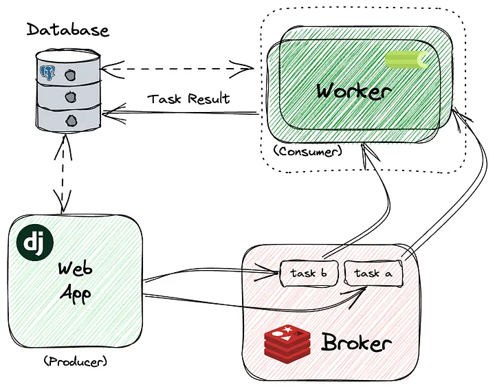

# Посібник по фонових задачах, воркерах та паралельній обробці в Python

## Вступ до Celery та його використання

У сучасних веб-додатках деякі задачі займають забагато часу, щоб виконувати їх у реальному часі. Наприклад, відправка email, обробка великих наборів даних або складні обчислення можуть суттєво сповільнити додаток, якщо виконувати їх у головному потоці. Тут на допомогу приходить Celery — розподілена черга задач у Python для асинхронного виконання в фоні, що дозволяє додатку залишатися чутливим та зменшує вузькі місця.

Використовуючи Celery, розробники можуть ставити довготривалі задачі в чергу для незалежного виконання, дозволяючи користувачам продовжувати роботу без затримок. Celery ефективний не лише для базового виконання задач, а й має потужні інструменти для планування, групування та організації задач у складних робочих процесах. Це робить його популярним вибором для Python-додатків, які потребують управління фоновими задачами.

---

### Основні переваги Celery

1. **Асинхронна обробка:** задачі виконуються незалежно, довготривалі функції не блокують головний потік.  
2. **Розподіл задач:** Celery може розподіляти задачі між кількома воркерами, підвищуючи масштабованість.  
3. **Паралелізм:** задачі можуть виконуватися паралельно на різних серверах або процесах.  
4. **Складні робочі процеси:** функції `chain`, `chord` та `group` дозволяють керувати багатокроковими задачами.  
5. **Надійність і масштабованість:** підходить як для малих, так і великих додатків, масштабуючись додаванням воркерів або налаштувань брокера.

### Типові сценарії використання Celery

- **Email-повідомлення:** відправка email у фоні, користувач не чекає.  
- **Обробка та агрегування даних:** обробка зображень, звітів або даних з різних джерел.  
- **Періодичні задачі:** щоденні бекапи або тижневі дайджести за допомогою Celery Beat.  
- **Інтеграція API:** запити до сторонніх API можна обробляти у фоні без блокування головного потоку.

---

## Як працює Celery: основні компоненти та архітектура

Основні компоненти: **Tasks, Workers та Brokers**. Вони працюють разом для ефективного оброблення та розподілу задач.



### 1. Tasks

Задача — це Python-функція, декорована для асинхронного виконання. Коли задача викликається, Celery надсилає її брокеру, який ставить її в чергу, а воркер обробляє її у фоні.

```python
from celery import Celery
app = Celery("example_project", broker="redis://localhost:6379/0")

@app.task
def add(x, y):
    return x + y
```
### 2. Workers

Воркери — це фонові процеси, які слухають чергу і виконують задачі. Можна запускати кілька воркерів для паралельного виконання задач:

```sh
$ celery -A core.celery.app worker -l INFO
```

### 3. Brokers

Брокер — посередник між додатком і воркерами. Він ставить задачі в черги та розподіляє їх. Найпопулярніші брокери:

- `Redis`: швидке in-memory сховище.
- `RabbitMQ`: потужний брокер для складної маршрутизації та управління чергами.

Брокер обирають залежно від потреб додатку.

## Приклади використання

### Виклик задач (Tasks) у Celery

Щоб виконати задачу асинхронно, використовують метод `.delay()` або `.apply_async()`:

```python
# Виклик через delay()
result = add.delay(4, 6)

# Виклик через apply_async() з додатковими параметрами
result = add.apply_async((4, 6), countdown=10)  # запуск через 10 секунд
```
- `delay()` — зручний синтаксис для простих викликів.
- `apply_async()` — гнучкий спосіб, дозволяє встановлювати відкладений старт, пріоритет, та параметри повторної спроби.

### Отримання результату задачі

Celery дозволяє відслідковувати статус та результат виконання задач:

```python
from celery.result import AsyncResult

task_id = result.id
res = AsyncResult(task_id)
print(res.status)      # PENDING, STARTED, SUCCESS, FAILURE

if res.ready():
    print(res.result)  # результат задачі
```
- `res.ready()` повертає True, якщо задача завершена.
- `res.result` містить результат, якщо задача успішно виконана.

### Повторні спроби (Retries)

Celery дозволяє автоматично повторювати задачі у разі помилок:

```python
from celery import shared_task

@shared_task(bind=True, max_retries=3)
def unstable_task(self):
    try:
        # Імітуємо помилку
        raise ValueError("Temporary failure")
    except Exception as exc:
        raise self.retry(exc=exc, countdown=5)
```

- `max_retries` — максимальна кількість повторних спроб.
- `countdown` — затримка перед повторною спробою.
Після перевищення max_retries задача видає `MaxRetriesExceededError`.

### Паралельна обробка задач

Celery підтримує:

- **Групи (groups)**: виконання декількох задач паралельно.
- **Ланцюги (chains)**: послідовне виконання задач.
- **Chord**: комбінує group і callback після завершення всіх задач.

Приклад групи:

```python
from celery import group

job = group(add.s(i, i) for i in range(10))()
results = job.get()  # повертає список результатів
```

- `.s()` — створює сигнатуру задачі для групи або ланцюга.
- `.get()` блокує, поки всі задачі групи завершаться і повертає результати.


### Планування задач (Periodic tasks)

Для періодичних задач Celery використовує `Celery Beat`. Це окремий процес, який періодично ставить задачі у чергу.

```python
from celery.schedules import crontab

app.conf.beat_schedule = {
    'send-report-every-day': {
        'task': 'send_report',
        'schedule': crontab(hour=7, minute=30),
    },
}
```
- `crontab` дозволяє гнучко налаштовувати час запуску.
- `Beat` працює разом з воркером, ставлячи задачі у чергу.

---

## Встановлення Celery та Redis та базове налаштування

Щоб використовувати Celery у своєму Python-проєкті, потрібно:

- встановити саму бібліотеку Celery;
- налаштувати message broker для черги задач;
- підключити Celery до вашого застосунку.

Це встановить бібліотеку `Celery`, яка дозволяє створювати та виконувати асинхронні задачі.

### Встановлення message broker

Окрім `Celery`, потрібен message broker — проміжний сервіс, який буде зберігати задачі в черзі до моменту, поки їх не забере worker.

Найпоширеніші варіанти:
- `Redis`
- `RabbitMQ`

Для простоти візьмемо `Redis`.

Щоб встановити Python-клієнт для Redis, виконайте:

```sh
$ pip install redis
```

Після встановлення Celery та Redis можна переходити до налаштування `Celery` у вашому проєкті.

`Celery` встановлюється через pip — стандартний менеджер пакетів Python.

У терміналі виконайте:

```bash
$ pip install celery
```

---

### Інтеграція з Django

У Django Celery налаштовується через Celery app у `core/celery.py`:


```sh
# приблизна структура проєкту
.
├── accounts
│   ├── admin.py
│   ├── apps.py
│   ├── __init__.py
│   ├── migrations
│   │   └── __init__.py
│   ├── models.py
│   ├── tasks
│   │   ├── reports.py
│   │   ├── emails.py
│   │   └── __init__.py
│   ├── tests.py
│   ├── urls.py
│   └── views.py
├── core
│   ├── asgi.py
│   ├── celery.py
│   ├── __init__.py
│   ├── settings.py
│   ├── urls.py
│   └── wsgi.py
├── env.example
├── manage.py
└── requirements.txt
```

`core/celery.py`

```python
import os
from celery import Celery

# встановити модуль налаштувань Django за замовчуванням для програми 'celery'.
os.environ.setdefault("DJANGO_SETTINGS_MODULE", "proj.settings")

# namespace='CELERY' означає всі налаштування для Celery
# повинні мати `CELERY_` префікс.
app = Celery("proj")
app.config_from_object("django.conf:settings", namespace="CELERY")

# авто-пошук задач в указаних модулях
app.autodiscover_tasks()
```

`core/settings.py`

```python
# в settings можна задати брокер та бекенд:
CELERY_BROKER_URL = "redis://localhost:6379/0"
CELERY_RESULT_BACKEND = "redis://localhost:6379/0"
```

`core/__init__.py`

```python
# Це гарантуватиме, що Celery app завжди імпортується під час
# запуску Django, щоб @shared_task використовував її
from .celery import app as celery_app

__all__ = ('celery_app',)
```

### Матеріал взято зі статті [Mastering Celery: A Guide to Background Tasks, Workers, and Parallel Processing in Python](https://khairi-brahmi.medium.com/mastering-celery-a-guide-to-background-tasks-workers-and-parallel-processing-in-python-eea575928c52)